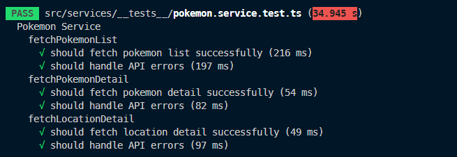
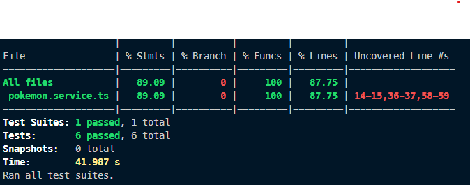

# BoltTech Pokemon Frontend UI & Backend API

This contains all the Frontend Code & Backend API implementation

# About the project implementation

## Tech Stack

- Frontend Framework: React.js + Vite
- CSS Framework: Tailwind CSS
- Backend Framework: Express.js
- Cache: node-cache
- Test: Jest


## Features Implemented 👨‍💻

- GET `/list` - Retrieve list of Pokemon ✔
- GET `/:id` - Retrieve Pokemon Details By Id ✔


## Run Locally

Clone the project

```bash
 git clone <Repo URL>
```

Go to the project directory

```bash
  cd bolttech-pokemon
```

## Frontend Setup

Go to the project directory

```bash
  cd client
```

Install dependencies

```bash
  npm install
```

Start the frontend vite server:

```bash
  npm run dev
```

Access Frontend UI

```bash
http://localhost:5173/
```

## Backend Setup

Go to the project directory

```bash
  cd server
```

Install dependencies

```bash
  npm install
```

This command will automatically start express server.

```bash
  npm run dev
```

Access Backend Server

```bash
http://localhost:3000/
```


## To run tests

```bash
cd server
```
```bash
npm run test
```


**Current Test Case Result:**




**Current Test Coverage Result:**



## Authors

- [@tejassrivastava](https://www.github.com/tejassrivastava)
